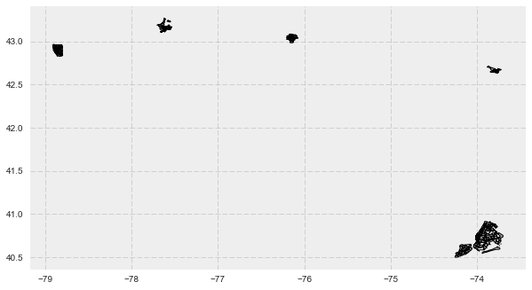
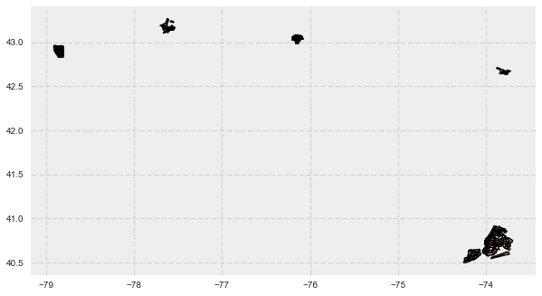

```python
import os
import pandas as pd
import numpy as np
from random import randint, uniform
from datetime import datetime
#from urllib3 import urlretrieve
from zipfile import ZipFile

```


```python
import geopandas as gpd
from geopandas import GeoDataFrame
from geopandas import GeoSeries
from shapely.geometry import Point
# from ipyleaflet import (Map,
#     Marker,
#     TileLayer, ImageOverlay,
#     Polyline, Polygon, Rectangle, Circle, CircleMarker,
#     GeoJSON,
#     DrawControl
# )

# plotting stuff
%matplotlib inline
import matplotlib.pyplot as plt
import seaborn as sns
plt.style.use('bmh')
plt.rcParams['figure.figsize'] = (10.0, 10.0)


#import warnings
#warnings.filterwarnings('ignore')
```


```python

```

    C:\Users\Green\downloads
    


```python
gdf = gpd.GeoDataFrame.from_file('ZillowNeighborhoods-NY.shp')

```


```python
gdf.head()
```


<div>
<table border="1" class="dataframe">
  <thead>
    <tr style="text-align: right;">
      <th></th>
      <th>CITY</th>
      <th>COUNTY</th>
      <th>NAME</th>
      <th>REGIONID</th>
      <th>STATE</th>
      <th>geometry</th>
    </tr>
  </thead>
  <tbody>
    <tr>
      <th>0</th>
      <td>Rochester</td>
      <td>Monroe</td>
      <td>Ellwanger-Barry</td>
      <td>343894.0</td>
      <td>NY</td>
      <td>POLYGON ((-77.61089090531659 43.1301330244914,...</td>
    </tr>
    <tr>
      <th>1</th>
      <td>New York City-Manhattan</td>
      <td>New York</td>
      <td>West Village</td>
      <td>270964.0</td>
      <td>NY</td>
      <td>POLYGON ((-74.0139885224368 40.72990919733, -7...</td>
    </tr>
    <tr>
      <th>2</th>
      <td>New York City-Brooklyn</td>
      <td>Kings</td>
      <td>Bensonhurst</td>
      <td>193285.0</td>
      <td>NY</td>
      <td>POLYGON ((-74.02166685535791 40.60317725534, -...</td>
    </tr>
    <tr>
      <th>3</th>
      <td>Buffalo</td>
      <td>Erie</td>
      <td>South Park</td>
      <td>270935.0</td>
      <td>NY</td>
      <td>POLYGON ((-78.83217 42.845958998119, -78.83217...</td>
    </tr>
    <tr>
      <th>4</th>
      <td>New York City-Manhattan</td>
      <td>New York</td>
      <td>East Village</td>
      <td>270829.0</td>
      <td>NY</td>
      <td>POLYGON ((-73.9873400213326 40.7337200243512, ...</td>
    </tr>
  </tbody>
</table>
</div>


```python
gdf.plot()
```


    <matplotlib.axes._subplots.AxesSubplot at 0x16436630>





```python
hulls = gdf['geometry'].convex_hull
hulls.plot(ax=gdf.plot())
```


    <matplotlib.axes._subplots.AxesSubplot at 0x11649c90>





```python
df = pd.read_csv("Superbowl.csv")# this is the already cleaned dataset from the Superbowl Exploratory Data Analysis
```


```python
gdf.shape
```


    (266, 6)


```python
geometry = GeoSeries([Point(x,y) for x,y in zip(df.dropoff_longitude, df.dropoff_latitude)])
#fuck['geometry'] = geometry
#fuck.crs = {'init': 'epsg:4326'}
crs = {'init': 'epsg:4326'}
#fuck = fuck.drop(['pickup_latitude', 'pickup_longitude'], axis=1)
geo_df = GeoDataFrame(df , crs=crs, geometry=geometry)
```


```python
#fuck['contains'] = fuck['point'].map(lambda x: True if hulls.contains(x) == hulls)
geo_df.shape
```


    (333485, 21)


```python
geo_df.head()
```


<div>
<table border="1" class="dataframe">
  <thead>
    <tr style="text-align: right;">
      <th></th>
      <th>tpep_pickup_datetime</th>
      <th>VendorID</th>
      <th>tpep_pickup_datetime.1</th>
      <th>tpep_dropoff_datetime</th>
      <th>passenger_count</th>
      <th>trip_distance</th>
      <th>pickup_longitude</th>
      <th>pickup_latitude</th>
      <th>RatecodeID</th>
      <th>dropoff_longitude</th>
      <th>...</th>
      <th>payment_type</th>
      <th>fare_amount</th>
      <th>extra</th>
      <th>tip_amount</th>
      <th>tolls_amount</th>
      <th>total_amount</th>
      <th>Trip_duration</th>
      <th>Average_Speed</th>
      <th>geometry</th>
      <th>Dropoff_burough</th>
    </tr>
  </thead>
  <tbody>
    <tr>
      <th>0</th>
      <td>16</td>
      <td>2</td>
      <td>2016-02-07 16:20:13</td>
      <td>2016-02-07 16:24:10</td>
      <td>1</td>
      <td>0.81</td>
      <td>-73.956573</td>
      <td>40.777836</td>
      <td>1</td>
      <td>-73.963730</td>
      <td>...</td>
      <td>1</td>
      <td>5.0</td>
      <td>0.0</td>
      <td>0.00</td>
      <td>0.0</td>
      <td>5.80</td>
      <td>3.950000</td>
      <td>12.303797</td>
      <td>POINT (-73.96372985839844 40.76803588867188)</td>
      <td>NA</td>
    </tr>
    <tr>
      <th>1</th>
      <td>16</td>
      <td>2</td>
      <td>2016-02-07 16:20:13</td>
      <td>2016-02-07 16:24:58</td>
      <td>5</td>
      <td>0.66</td>
      <td>-74.002708</td>
      <td>40.718124</td>
      <td>1</td>
      <td>-74.009361</td>
      <td>...</td>
      <td>1</td>
      <td>5.0</td>
      <td>0.0</td>
      <td>1.16</td>
      <td>0.0</td>
      <td>6.96</td>
      <td>4.750000</td>
      <td>8.336842</td>
      <td>POINT (-74.00936126708984 40.71017837524415)</td>
      <td>NA</td>
    </tr>
    <tr>
      <th>2</th>
      <td>16</td>
      <td>2</td>
      <td>2016-02-07 16:20:14</td>
      <td>2016-02-07 16:37:27</td>
      <td>1</td>
      <td>2.79</td>
      <td>-73.998100</td>
      <td>40.722713</td>
      <td>1</td>
      <td>-73.951157</td>
      <td>...</td>
      <td>2</td>
      <td>14.0</td>
      <td>0.0</td>
      <td>0.00</td>
      <td>0.0</td>
      <td>14.80</td>
      <td>17.216667</td>
      <td>9.723136</td>
      <td>POINT (-73.95115661621094 40.71022415161133)</td>
      <td>NA</td>
    </tr>
    <tr>
      <th>3</th>
      <td>16</td>
      <td>2</td>
      <td>2016-02-07 16:20:14</td>
      <td>2016-02-07 16:32:12</td>
      <td>3</td>
      <td>2.27</td>
      <td>-73.987732</td>
      <td>40.738522</td>
      <td>1</td>
      <td>-73.981857</td>
      <td>...</td>
      <td>2</td>
      <td>10.5</td>
      <td>0.0</td>
      <td>0.00</td>
      <td>0.0</td>
      <td>11.30</td>
      <td>11.966667</td>
      <td>11.381616</td>
      <td>POINT (-73.98185729980467 40.76462936401367)</td>
      <td>NA</td>
    </tr>
    <tr>
      <th>4</th>
      <td>16</td>
      <td>2</td>
      <td>2016-02-07 16:20:14</td>
      <td>2016-02-07 16:25:58</td>
      <td>1</td>
      <td>1.42</td>
      <td>-73.985939</td>
      <td>40.777916</td>
      <td>1</td>
      <td>-73.995277</td>
      <td>...</td>
      <td>2</td>
      <td>7.0</td>
      <td>0.0</td>
      <td>0.00</td>
      <td>0.0</td>
      <td>7.80</td>
      <td>5.733333</td>
      <td>14.860465</td>
      <td>POINT (-73.99527740478516 40.76121139526367)</td>
      <td>NA</td>
    </tr>
  </tbody>
</table>
<p>5 rows × 21 columns</p>
</div>


```python
geo_df['Dropoff_burough'] = "NA"
brooklen = gdf.geometry[1]
for i in range(0,266):
    #gdf.geometry[i].contains(fuck.geometry)
    k = 0
    for j in geo_df.geometry.within(gdf.geometry[i]):
        #print(j)
        if j == True:
            geo_df['Dropoff_burough'][k] = gdf['NAME'][i]
            k = k + 1
        else:
            k = k + 1
```

    C:\Users\Green\Anaconda3\lib\site-packages\ipykernel\__main__.py:9: SettingWithCopyWarning: 
    A value is trying to be set on a copy of a slice from a DataFrame
    
    See the caveats in the documentation: http://pandas.pydata.org/pandas-docs/stable/indexing.html#indexing-view-versus-copy
    


```python
for i in range()
fuck.geometery.within(gdf.geometry[i])
```


```python
geo_df.head()
```


<div>
<table border="1" class="dataframe">
  <thead>
    <tr style="text-align: right;">
      <th></th>
      <th>tpep_pickup_datetime</th>
      <th>VendorID</th>
      <th>tpep_pickup_datetime.1</th>
      <th>tpep_dropoff_datetime</th>
      <th>passenger_count</th>
      <th>trip_distance</th>
      <th>pickup_longitude</th>
      <th>pickup_latitude</th>
      <th>RatecodeID</th>
      <th>dropoff_longitude</th>
      <th>...</th>
      <th>payment_type</th>
      <th>fare_amount</th>
      <th>extra</th>
      <th>tip_amount</th>
      <th>tolls_amount</th>
      <th>total_amount</th>
      <th>Trip_duration</th>
      <th>Average_Speed</th>
      <th>geometry</th>
      <th>Pickup_burough</th>
    </tr>
  </thead>
  <tbody>
    <tr>
      <th>0</th>
      <td>16</td>
      <td>2</td>
      <td>2016-02-07 16:20:13</td>
      <td>2016-02-07 16:24:10</td>
      <td>1</td>
      <td>0.81</td>
      <td>-73.956573</td>
      <td>40.777836</td>
      <td>1</td>
      <td>-73.963730</td>
      <td>...</td>
      <td>1</td>
      <td>5.0</td>
      <td>0.0</td>
      <td>0.00</td>
      <td>0.0</td>
      <td>5.80</td>
      <td>3.950000</td>
      <td>12.303797</td>
      <td>POINT (-73.95657348632813 40.77783584594727)</td>
      <td>Upper East Side</td>
    </tr>
    <tr>
      <th>1</th>
      <td>16</td>
      <td>2</td>
      <td>2016-02-07 16:20:13</td>
      <td>2016-02-07 16:24:58</td>
      <td>5</td>
      <td>0.66</td>
      <td>-74.002708</td>
      <td>40.718124</td>
      <td>1</td>
      <td>-74.009361</td>
      <td>...</td>
      <td>1</td>
      <td>5.0</td>
      <td>0.0</td>
      <td>1.16</td>
      <td>0.0</td>
      <td>6.96</td>
      <td>4.750000</td>
      <td>8.336842</td>
      <td>POINT (-74.00270843505859 40.71812438964844)</td>
      <td>Tribeca</td>
    </tr>
    <tr>
      <th>2</th>
      <td>16</td>
      <td>2</td>
      <td>2016-02-07 16:20:14</td>
      <td>2016-02-07 16:37:27</td>
      <td>1</td>
      <td>2.79</td>
      <td>-73.998100</td>
      <td>40.722713</td>
      <td>1</td>
      <td>-73.951157</td>
      <td>...</td>
      <td>2</td>
      <td>14.0</td>
      <td>0.0</td>
      <td>0.00</td>
      <td>0.0</td>
      <td>14.80</td>
      <td>17.216667</td>
      <td>9.723136</td>
      <td>POINT (-73.99810028076173 40.72271347045898)</td>
      <td>Soho</td>
    </tr>
    <tr>
      <th>3</th>
      <td>16</td>
      <td>2</td>
      <td>2016-02-07 16:20:14</td>
      <td>2016-02-07 16:32:12</td>
      <td>3</td>
      <td>2.27</td>
      <td>-73.987732</td>
      <td>40.738522</td>
      <td>1</td>
      <td>-73.981857</td>
      <td>...</td>
      <td>2</td>
      <td>10.5</td>
      <td>0.0</td>
      <td>0.00</td>
      <td>0.0</td>
      <td>11.30</td>
      <td>11.966667</td>
      <td>11.381616</td>
      <td>POINT (-73.98773193359375 40.73852157592773)</td>
      <td>Gramercy</td>
    </tr>
    <tr>
      <th>4</th>
      <td>16</td>
      <td>2</td>
      <td>2016-02-07 16:20:14</td>
      <td>2016-02-07 16:25:58</td>
      <td>1</td>
      <td>1.42</td>
      <td>-73.985939</td>
      <td>40.777916</td>
      <td>1</td>
      <td>-73.995277</td>
      <td>...</td>
      <td>2</td>
      <td>7.0</td>
      <td>0.0</td>
      <td>0.00</td>
      <td>0.0</td>
      <td>7.80</td>
      <td>5.733333</td>
      <td>14.860465</td>
      <td>POINT (-73.98593902587891 40.77791595458984)</td>
      <td>Upper West Side</td>
    </tr>
  </tbody>
</table>
<p>5 rows × 21 columns</p>
</div>


```python
geo_df.columns.values[19] = 'geo' 
```


```python
geo_df.to_csv('New_superbowl_drop.csv')
```


```python

```
